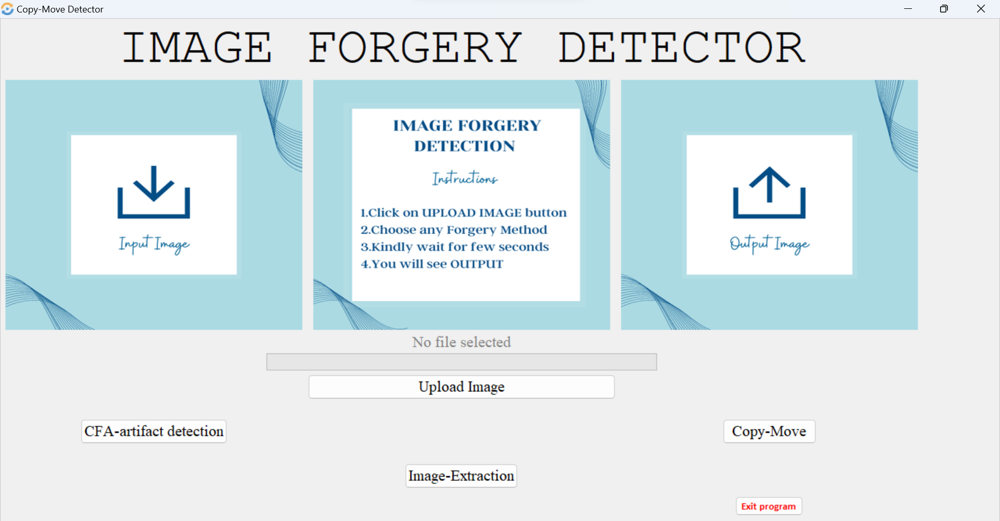
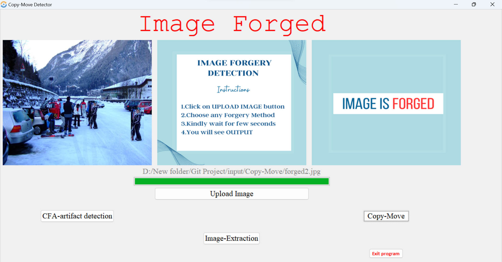
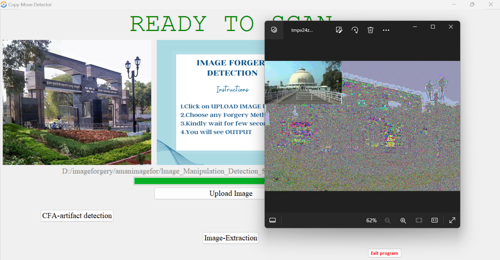
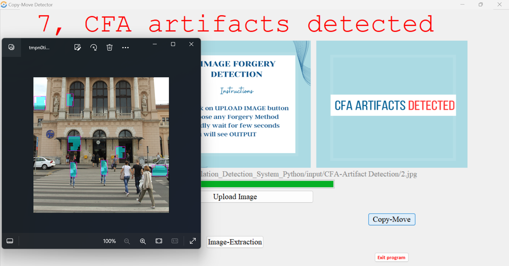

# IMAGE FORGERY DETECTION SYSTEM
Image forgery detection is a critical area of research due to the increasing availability of digital manipulation tools capable of creating deceptive images. In this project, we propose a Forgery Detection System that detects tampered images using different algorithms such as copy-move forgery, CFA (Colour Filter Array) manipulation and Image Extraction. By leveraging sophisticated algorithms and advanced analysis methods, our approach overcomes the limitations of manual inspection and subjective visual analysis. Experimental results demonstrate the high accuracy of our proposed approach in distinguishing between original and tampered images. It provides an objective and reliable means of identifying forged regions, mitigating the potential consequences of image manipulation. Through our project, we aim to contribute to the establishment of a more trustworthy digital environment. By detecting and exposing image forgery, we enhance the integrity of digital media.

# Image Forgery Detection Tool
The forgery detection tool contained in this repository currently features forensic methods to detect the following:

- Copy-move forgeries
- CFA artifacts
- Image Extraction


## To Execute:
<!-- Insert any(JPEG) images you want to analyze into the **image** folder Located in the Project directory. -->
Go to the Project directory:

```
$ cd Image_Forgery_Detection_System_Python
```

Next, run the **detect.py** script, providing the image you wish to evaluate:
```
$ python GUI.py
```

Once finished, details on the image will be reported in the terminal. Supplemental images generated during copy-move forgery detection can be found in the output directory.

##  IMAGES

###  User Interface


### Copy Move Forgery


###  Image Extraction


###  CFA Artifacts


